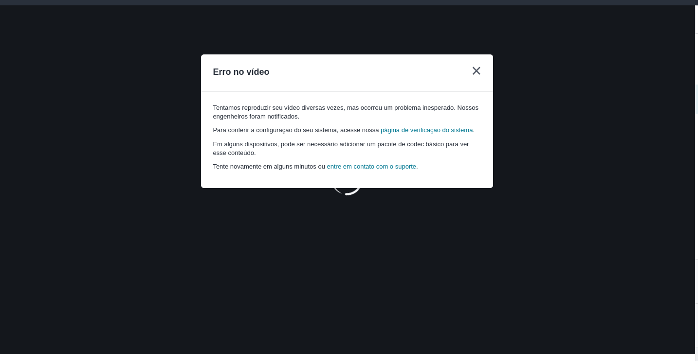

### Script para o Fedora 31 | 32
---

Ambiente de DevOps na plataforma Fedora 31 | 32

---
### Site da Udemy não roda no linux oque fazer

Seguir os passos do script:
* "plugins_midia.sh"
Nele mostrará como resolver tais problemas
